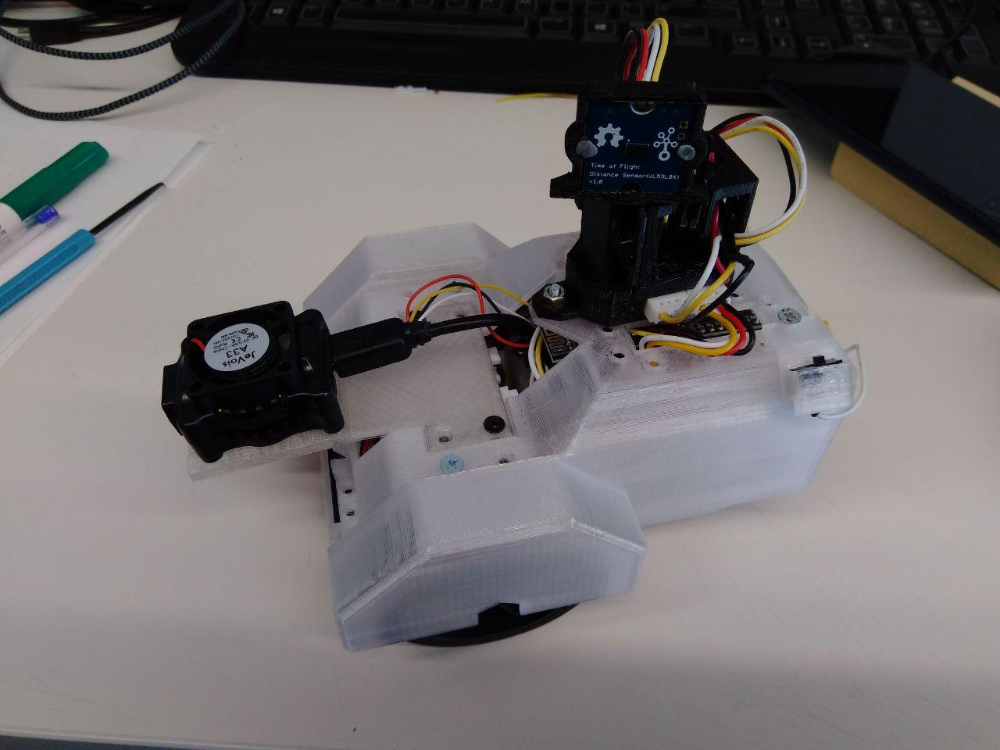
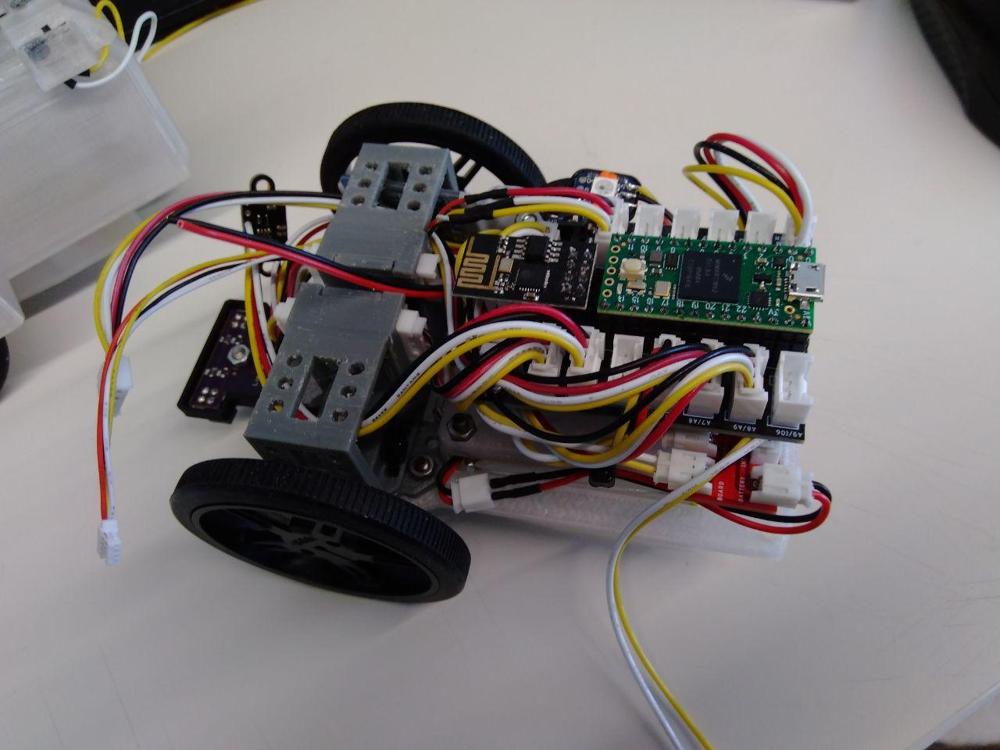
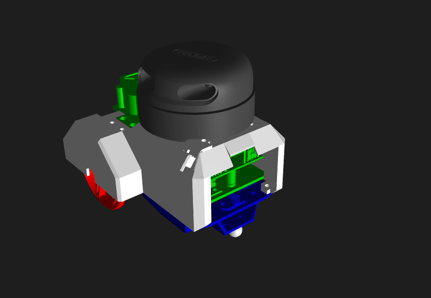
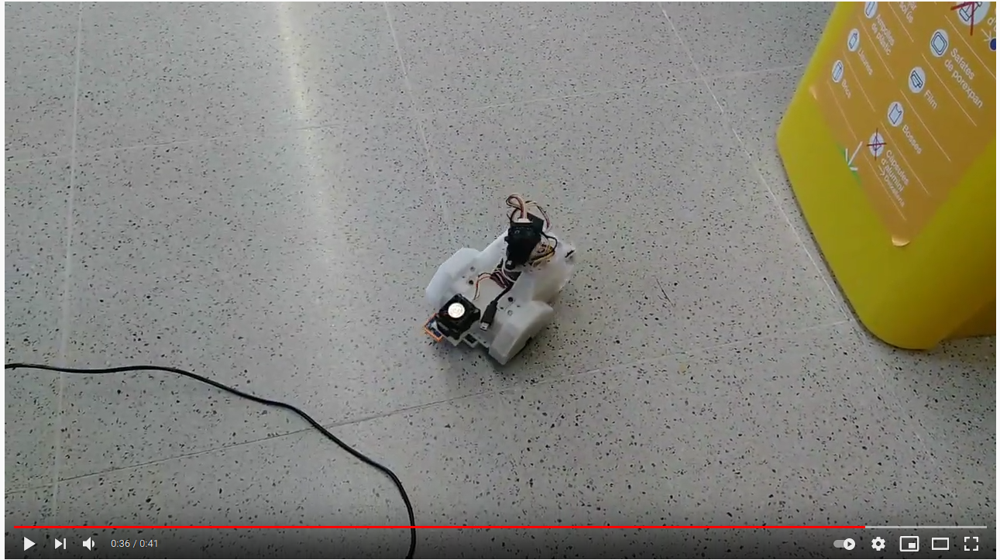
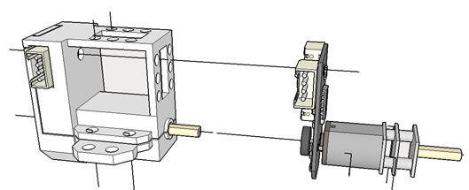
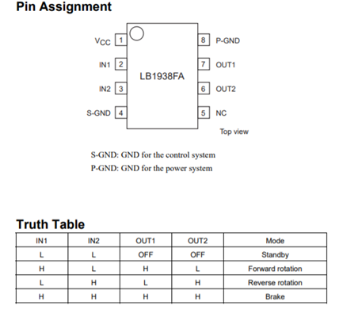
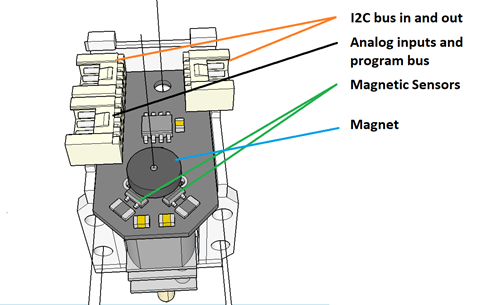

# roseco
Roseco: Diff-Robot base in ROS

This repository hosts the source code for the ROS < ROSECo > package.

 

This is part of the practices that I am doing in the course MAstering Robot orerating System ROS in the ROBOCADEMY

## Description ##

The robot type is a diff-robot with two driving wheels and a caster wheel. 

- Teensy 4.0 .
- wifi with ESP8266.
- Bluetooh.
- Motors Controlled by i2c more detail in the electronics section.
- 3.7v Lipo battery of 6000 mah, with a Powerboost that provides us with 5 v.
- Induction charging system.
- camera Jevois
- You can add sensors or actuators, giving it great versatility.
- Optionally you can add a raspberry pi 3 or 4 with camera.

## Key concepts covered ##
- The goal of this app is to practice with urdf and xacro, and implement it in gazebo to simulate.

- Create a model base in the stl.

- Create a xacro:macro

- Navigation next update

## Update ##

- roseco_description

- roseco_gazebo

- roseco_control --> not finish

- Electronics

## Usage ## 

To use the `roseco` package clone this repository into the `src` folder of your catkin workspace.

Then build the workspace with `catkin_make`.

   roslaunch roseco_description view_roseco.launch 

   roslaunch roseco_gazebo roseco.launch   

   roslaunch roseco_control roseco_control.launch 

 
## Electronics : Servo motor with I2C## 

| 
 |
| --- |
| **ServoMotor model for Ecology20 and detail of the interior circuit** |

The servomotor consists of a controller board with a PIC16f1503 and a LB1938FA driver, which drive a Pololu &quot;Micro-metal-gearmotors&quot; type reduction motor. The reduction of the motors is based on the need:

- 100: 1, 130 rpm
- 298:1, 45 rpm

The microcontroller communicates through I2C, which allows us to connect 127 nodes in series. There will not be so many in our applications, we have asked for LP motors, Low power because they have a low consumption that allows us to connect them in series.

The I2c address will depend on the application that we are going to make, it should not be a problem to change it depending on the needs, but we are going to give a few premises. The I2C addresses are defined by 7 bits, the least significant bit tells us if it is writing or reading, so we will give a couple of addresses, the first is the one recorded in the pic, and the other is the one we will use in the Arduino / teensy to communicate. Always in Hexadecinal.

- Servomotor right 0x20 ? 0x10
- Servomotor left 0x22 ? 0x11

### Driver

El driver el chip [LB1938FA](https://www.dropbox.com/s/l5har1ai8nknbxs/LB1938FA.pdf?dl=0), es un driver configurado en puente-H que nos permite controlar el motor en velocidad y dirección con solo dos inputs. Analizando el driver que llevan los servomotores de DFRobot, el L9110S busque alternativas pues el susodicho driver esta un poco descatalogado o solo se vende en páginas de dudosa fiabilidad.

| 
 |
| --- |
| **LB1938FA is the cousin of the L9110S carried by Dfrobotics servos.** |

### The inputs IN1 and IN2 of the driver are the RC5 and RC3 outputs of the PIC16f1503 respectively that can operate as PWM1 and PWM2.

###

### Software

| 
 |
| --- |
| **Detail of the motor control board** |

The same board can serve different purposes, for example, in the robotic arm we need positioning and hold, while the Eco\_robot we are interested in speed. For this reason and everything that the program is going to be very similar we will have to make different versions. Or group them all in one, although I am afraid that the memory of the PI16f1503 (2Kwords) is not going to give that much.

The encoder gives 12 points per turn, which must be multiplied by the reduction to know how many pulses per turn they give.
